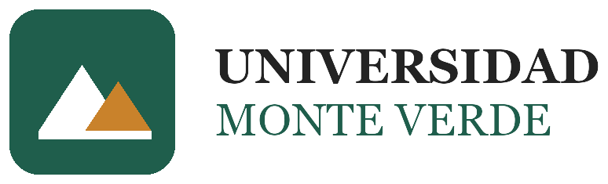
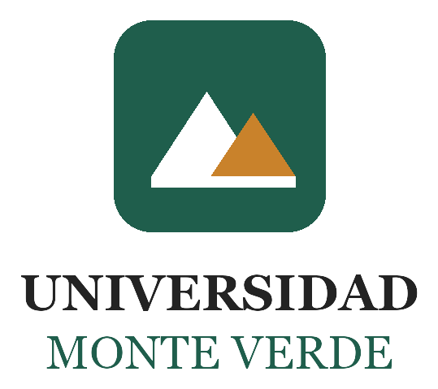
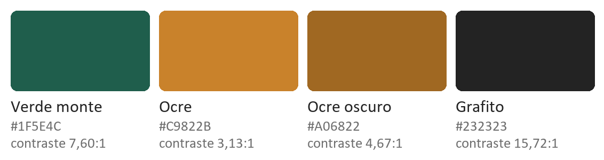
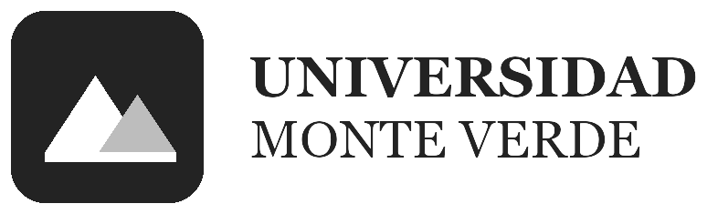

# Manual de Identidad Visual Corporativa

## Universidad Monte Verde

---

> ## ⚠️ Esta institución no existe
>
> **La Universidad Monte Verde, su logosímbolo, sus colores y la resolución
> que aparece más abajo son inventados para este curso.**
>
> Se escribieron así —con el tono y la estructura de un manual real— porque
> el proyecto de aula necesita una identidad visual que respetar, y aprender
> a leer un documento de marca es parte del ejercicio. No corresponde a
> ninguna universidad real, y ningún valor de aquí debe usarse fuera del
> curso.

---

## Resolución de Rectoría General n.º 112

**Del 3 de febrero de 2026**

*Por la cual se adopta el Manual de Identidad Visual Corporativa de la
Universidad Monte Verde.*

El Rector General de la Universidad Monte Verde, en uso de sus atribuciones
legales y estatutarias, y

**CONSIDERANDO:**

1. Que la identidad visual es el primer signo con el que la comunidad
   reconoce a la institución, y su uso disperso la debilita.
2. Que las dependencias, los programas y los sistemas de información de la
   Universidad producen a diario piezas que la representan.
3. Que se requiere un instrumento único que fije los valores de esa
   identidad y las condiciones de su uso.

**RESUELVE:**

**ARTÍCULO PRIMERO.** Adoptar el Manual de Identidad Visual Corporativa que
se recoge en este documento.

**ARTÍCULO SEGUNDO.** Su cumplimiento es **obligatorio** para toda pieza
impresa o digital que represente a la Universidad, incluidos los sistemas de
información desarrollados por sus dependencias o por terceros.

**ARTÍCULO TERCERO.** **Por ningún motivo se deben cambiar los colores
corporativos.**

**ARTÍCULO CUARTO.** La presente resolución rige a partir de la fecha de su
expedición.

---

## 1. El logosímbolo

El logosímbolo se compone de **isotipo** —el monte— y **logotipo** —el
nombre—. No se usan por separado salvo en los casos que este manual autoriza.

### Versión horizontal

Es la versión **preferente** en pantalla: aprovecha el ancho disponible y
deja el nombre legible.

### Versión vertical

Para espacios estrechos o cuadrados: portadas, carteles, avatares grandes.

### Isotipo solo

**Se autoriza únicamente** cuando el nombre de la Universidad ya aparece en
la pieza, o cuando el espacio no admite texto legible: favicon, icono de
aplicación, sello.

### Qué significa

El monte blanco es el conocimiento ya alcanzado; el ocre, el que falta por
subir. La línea de base que los une es la comunidad que sostiene a los dos.

---

## 2. Paleta de colores institucionales

| Color | Hexadecimal | RGB | Uso |
|---|---|---|---|
| **Verde monte** | `#1F5E4C` | 31, 94, 76 | Color principal. Barras, títulos, fondos institucionales |
| **Ocre** | `#C9822B` | 201, 130, 43 | Acento: líneas, iconos, rellenos y **texto grande** |
| **Ocre oscuro** | `#A06822` | 160, 104, 34 | La variante del ocre **cuando lleva texto de tamaño normal** |
| **Grafito** | `#232323` | 35, 35, 35 | Texto |

**Colores de apoyo**, para estados del sistema:

| Color | Hexadecimal | Uso |
|---|---|---|
| Blanco | `#FFFFFF` | Fondo principal |
| Gris claro | `#F2F1EE` | Fondos de tablas y tarjetas |
| Gris borde | `#D8D6D1` | Líneas y separadores |
| Verde correcto | `#2E7D4F` | Confirmaciones |
| Rojo alerta | `#B3382F` | Errores |

> **Artículo tercero de la resolución: por ningún motivo se deben cambiar
> los colores corporativos.** No son una preferencia de quien diseña: son
> una restricción.

### Contraste: los números medidos

El nivel **AA de las WCAG 2.2** exige una relación de contraste de **4.5:1**
para texto normal y **3:1** para texto grande —que la norma define desde
**18 pt**, o **14 pt en negrita**, unos 24 px y 18,66 px en pantalla— y para
elementos que no son texto.

Estas son las relaciones **medidas** de esta paleta sobre blanco:

| Color | Relación | Texto normal (4.5:1) | Texto grande (3:1) |
|---|---|---|---|
| Grafito `#232323` | **15,72:1** | ✅ | ✅ |
| Verde monte `#1F5E4C` | **7,60:1** | ✅ | ✅ |
| Rojo alerta `#B3382F` | **5,96:1** | ✅ | ✅ |
| Verde correcto `#2E7D4F` | **5,05:1** | ✅ | ✅ |
| Ocre oscuro `#A06822` | **4,67:1** | ✅ | ✅ |
| Ocre `#C9822B` | **3,13:1** | ❌ | ✅ |

**El ocre institucional no alcanza los 4.5:1 — ni como texto sobre blanco, ni
como fondo con texto blanco** (la relación es la misma en los dos sentidos:
3,13:1). Por eso:

- El ocre se usa en **líneas, iconos, rellenos y títulos grandes**.
- Cuando el ocre tenga que llevar **texto de tamaño normal**, se usa el
  **ocre oscuro `#A06822`**, que sí cumple.

> **Esto no se afirma de memoria: se calcula.** La fórmula está en las WCAG
> 2.2 y cualquiera puede rehacer la cuenta. Un manual que dice «nuestros
> colores son accesibles» sin el número, no dice nada.

---

## 3. Escala de grises

Cuando la pieza va a un solo color —fotocopia, sello, fax, impresión
económica—:

**La regla:** el verde monte se reemplaza por el **grafito**, y el ocre por
una **trama del grafito al 30 %**. No se convierte «a gris» sin más: el ocre
y el verde tienen luminosidad parecida y en escala de grises se confundirían.

---

## 4. Tipografía

| Uso | Familia | Por qué |
|---|---|---|
| **Logotipo** | **Georgia** | Serif de pantalla, robusta en tamaños grandes |
| **Títulos** | **Merriweather** | Serif diseñada para leerse en pantalla |
| **Texto corrido e interfaz** | **Inter** | Alta legibilidad en tamaños pequeños |
| **Alternativa de interfaz** | **Lato** | Autorizada cuando Inter no esté disponible |

**Ninguna otra familia está autorizada.** Si el medio no admite estas, se usa
la genérica del sistema: `serif` para títulos, `sans-serif` para el resto.

Las tres secundarias son de código abierto y se obtienen en
[Google Fonts](https://fonts.google.com/): Merriweather, Inter y Lato.

---

## 5. Tamaño mínimo y área de reserva

### Tamaño mínimo

Por debajo de estas medidas el monte deja de distinguirse:

| Versión | En pantalla | Impreso |
|---|---|---|
| Horizontal | **160 × 48 px** | 3,2 × 1,0 cm |
| Vertical | **90 × 80 px** | 1,8 × 1,6 cm |
| Isotipo | **32 × 32 px** | 0,8 × 0,8 cm |

### Área de reserva

Alrededor del logosímbolo debe quedar libre, como mínimo, **una distancia
igual a la altura de la letra «U» del logotipo**. En esa franja no entra
texto, ni imágenes, ni bordes, ni otro logo.

---

## 6. Usos incorrectos

Ninguno de estos se autoriza:

| | |
|---|---|
| ❌ Cambiar los colores | Ni «solo un poco», ni para que combine con otra cosa |
| ❌ Deformar el logosímbolo | Se escala manteniendo la proporción, siempre |
| ❌ Rotarlo o inclinarlo | |
| ❌ Ponerle sombra, borde, relieve o degradado | |
| ❌ Cambiar la tipografía del logotipo | |
| ❌ Reescribir el nombre en otra fuente y llamarlo logo | |
| ❌ Ponerlo sobre una foto sin suficiente contraste | Va sobre una banda blanca |
| ❌ Separar el isotipo del logotipo fuera de los casos del punto 1 | |
| ❌ Meter texto dentro del área de reserva | |

---

## 7. Uso en los sistemas de información

Esta sección aplica a lo que se construye en este proyecto.

1. **Los valores del manual van en un archivo aparte** —`marca.css`— y no
   mezclados con los estilos de la aplicación. Aquí están los valores que
   fija el manual; allá, cómo se usan. El día que la Universidad actualice
   su manual, se cambia un archivo y nada más.
2. **El logosímbolo va sobre fondo blanco**, en su versión a color. Sobre la
   barra verde se usaría la versión negativa, que este manual no contempla:
   por eso la barra lleva una banda blanca detrás del logo.
3. **El favicon** usa el isotipo.
4. **Los colores de estado** —correcto, error— son los de apoyo del punto 2,
   no el verde y el ocre institucionales. Un error en ocre se lee como
   decoración; en rojo alerta, como error.

---

## 8. Vigencia

Este manual rige desde el 3 de febrero de 2026 y reemplaza cualquier versión
anterior. Las dudas sobre su aplicación las resuelve la Oficina de
Comunicaciones de la Universidad Monte Verde.

**Institución, resolución y manual son ficticios, y existen solo para este
curso.**
