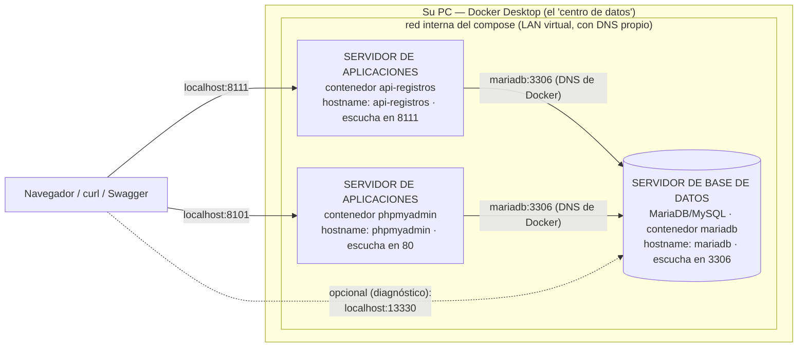

# Conceptos de Docker — imagen, contenedor, volumen, compose y Kubernetes

> Documento conceptual del curso. En la v1 usted ya usó Docker (el
> `docker compose up -d --build` que levanta la BD y la API); aquí está el
> mapa completo de conceptos, con los ejemplos de este proyecto y lo que
> viene en la ruta de versiones.

---

## 1. ¿Qué problema resuelve Docker?

"En mi máquina sí funciona." Cada estudiante tiene un PC distinto (Windows,
versiones, configuraciones) y un software como MariaDB instalado a mano se
comporta distinto en cada uno. Docker empaqueta el software **con todo su
entorno** en una unidad estándar que corre igual en cualquier máquina.
En este curso: nadie instala MariaDB ni PHP — todos corren **el mismo contenedor**.

## 2. Imagen

Una imagen es una **plantilla inmutable y empaquetada**: un sistema de
archivos congelado (SO base + programa + librerías + configuración) más
metadatos (qué comando arrancar, qué puerto expone).

- **Inmutable**: una vez construida, no cambia. Cambiar algo = construir OTRA imagen.
- Se construye en **capas** (cada instrucción de un `Dockerfile` es una capa
  que se cachea — por eso las reconstrucciones son rápidas).
- Viene de un **registro** (Docker Hub) o se construye localmente. En la v1
  usamos una del registro: `mariadb:11` (el `:11` es la
  **etiqueta**: la versión 11 de MariaDB).

**Analogía:** la imagen es el **molde de la galleta**.

## 3. Contenedor

Un contenedor es una **instancia viva de una imagen**: un proceso corriendo
con su propio sistema de archivos, red y espacio de procesos, aislado del
resto de su PC.

- De una imagen salen **muchos contenedores** (galletas del mismo molde).
- Es **efímero y desechable**: `docker compose down` lo destruye sin drama, y
  se recrea idéntico con `docker compose up -d`.
- **No es una máquina virtual**: no carga un sistema operativo completo —
  comparte el kernel del host con aislamiento de procesos. Por eso arranca en
  segundos y pesa MB, no GB.
- En la v1: `proyecto_php1-mariadb-1` es un contenedor creado desde la imagen
  `mariadb:11`, con el puerto interno 3306 **publicado** en el 13330 de su PC
  (`"13330:3306"` en el compose).

**Analogía:** el contenedor es la **galleta**.

## 4. Volumen (y el estado)

Si los contenedores son desechables… ¿dónde viven los datos? En
**almacenamiento que sobrevive al contenedor**:

| Mecanismo | Qué es | En este proyecto |
|---|---|---|
| **Volumen** | Espacio administrado por Docker, montado dentro del contenedor | Los datos de MariaDB (`mariadbdata` — por eso `docker compose down`/`up` los conserva) |
| **Bind mount** | Una carpeta de SU disco montada dentro del contenedor | la línea `./db/init.sql:/docker-entrypoint-initdb.d/init.sql:ro` del compose — el script de la BD entra al contenedor desde su carpeta (`:ro` = solo lectura) |

Detalle importante que ya vivió en la v1: MariaDB ejecuta el `init.sql`
**solo la primera vez** (cuando su almacenamiento está vacío). Por eso el
"reset" de la BD es destruir y recrear el contenedor — no reiniciarlo.

**La regla de oro que ata los tres conceptos:** *la imagen es inmutable, el
contenedor es desechable, y el volumen es lo único que debe importarte
perder.*

```
Dockerfile   →  IMAGEN      →  CONTENEDOR   →  VOLUMEN
(receta)        (molde)        (galleta)       (la memoria)
             docker build    docker run       -v / volumes
```

> **La sorpresa que confunde a todo el mundo:** el volumen sobrevive
> INCLUSO a borrar la carpeta del proyecto. Si usted borra la carpeta,
> vuelve a hacer `git clone` y ejecuta `docker compose up -d --build`,
> la BD arranca **con los datos de la última vez** — no con las semillas.
> ¿Por qué? El volumen no vive en la carpeta: vive en el área de Docker,
> identificado por el nombre del proyecto compose (= el nombre de la
> carpeta). Misma carpeta → mismo nombre → mismo volumen de siempre.
>
> | Comando | ¿Y los datos? |
> |---|---|
> | `docker compose up -d --build` | Se conservan |
> | `docker compose down` | Se conservan |
> | borrar la carpeta y re-clonar | **Se conservan** (el volumen no estaba ahí) |
> | `docker compose down -v` | **SE BORRAN** — el único que resetea |
>
> Para una demo con las semillas exactas:
> `docker compose down -v` y luego `docker compose up -d --build`.

### El despliegue de ESTE proyecto, dibujado (Mermaid)

Todo lo anterior, junto: lo que `docker compose up -d` levanta aquí es un
**sistema de servidores en miniatura** — cada contenedor es un servidor
con su propio hostname, unidos por la red interna del compose:



**Guía de lectura:** los servicios se hablan entre sí **por nombre**
(el DNS interno de Docker resuelve `postgres`, `api-registros`, etc. a la
IP del contenedor — jamás `localhost`, que dentro de un contenedor es él
mismo). Hacia su PC solo existen las puertas `localhost:PUERTO` que el
compose publica. Por eso este mismo diseño se despliega igual en un
servidor real: cambiar de máquina no cambia la arquitectura.

## 5. Docker Compose (el "un solo comando" del proyecto)

¿Cómo levantar VARIOS contenedores (BD + API, y pronto más) sin escribir N
comandos `docker run` con todos sus flags, en el orden correcto, cada vez?

**Compose** es la respuesta **declarativa**: un archivo `docker-compose.yml`
(formato YAML) que declara el estado deseado del sistema completo — qué
servicios existen, de qué imagen sale cada uno, puertos, volúmenes, variables
y dependencias — y `docker compose up -d` lo materializa. Es **declarativo,
no imperativo**: usted no escribe los pasos, escribe el resultado; en cada
`up -d` Compose compara lo declarado con lo que corre y solo recrea lo que
cambió (el mismo espíritu de SDD: describir el QUÉ).

### El `docker-compose.yml` de ESTE proyecto, explicado línea por línea

Es el archivo que está en la raíz desde la v1 (mínimo: BD + API) y que
**crecerá con las versiones** hasta orquestar los 3 motores, las 2 APIs y el
front. Esto es lo que dice hoy:

```yaml
services:                          # el mapa de TODOS los contenedores del sistema

  mariadb:                         # ← este nombre es también su HOSTNAME interno
    image: mariadb:11              # imagen del registro (no se construye)
    environment:                   # variables que la imagen usa al crear la BD
      MARIADB_ROOT_PASSWORD: paradigmas123
      MARIADB_DATABASE: investigacion_php_local
      MARIADB_USER: paradigmas
      MARIADB_PASSWORD: paradigmas123
    volumes:
      - mariadbdata:/var/lib/mysql           # volumen NOMBRADO: los datos sobreviven
      - ./db/init.sql:/docker-entrypoint-initdb.d/init.sql:ro
        # ↑ bind mount: SU archivo entra al contenedor (:ro = solo lectura).
        #   MariaDB ejecuta lo que haya en esa carpeta SOLO si el volumen
        #   está vacío (primera vez) — por eso el reset es `down -v`.
    ports:
      - "13330:3306"               # "puerto en su PC : puerto interno del contenedor"
    healthcheck:                   # cómo saber si la BD ya RESPONDE (no solo "existe")
      test: ["CMD", "healthcheck.sh", "--connect", "--innodb_initialized"]
      interval: 5s
      timeout: 5s
      retries: 10

  api-registros:
    build: ./api_investigacion          # esta imagen SE CONSTRUYE con el Dockerfile de esa carpeta
    volumes:
      - ./api_investigacion:/app        # el código montado: guardar un .php = refrescar
    restart: unless-stopped        # si el proceso muere, Docker lo levanta de nuevo
    ports:
      - "8111:8111"                # http://localhost:8111
    environment:
      # El DSN usa el NOMBRE del servicio como host (mariadb:3306), no
      # localhost: dentro de la red interna de compose los servicios se
      # resuelven por nombre (DNS propio).
      DB_DSN: mysql:host=mariadb;port=3306;dbname=investigacion_php_local
      DB_USUARIO: paradigmas
      DB_CLAVE: paradigmas123
    depends_on:
      mariadb:
        condition: service_healthy # arranca cuando la BD RESPONDE (healthcheck), no por azar

  phpmyadmin:                      # administrador web de MariaDB (también un contenedor)
    image: phpmyadmin:latest       # imagen del registro: no escribimos ni una línea de él
    environment:
      PMA_HOST: mariadb            # a cuál servidor se conecta: el nombre del servicio
      PMA_USER: paradigmas
      PMA_PASSWORD: paradigmas123
    ports:
      - "8101:80"                  # http://localhost:8101 (adentro escucha en el 80)
    depends_on:
      - mariadb                    # versión simple: solo orden de arranque

volumes:
  mariadbdata:                     # declaración del volumen nombrado (la "memoria" de la BD)
```

Las tres ideas que este archivo demuestra:

1. **Dos redes de nombres**: hacia su PC, puertos publicados
   (`localhost:8111`, `localhost:8101`, `localhost:13330`); entre
   contenedores, nombres de servicio (`mariadb:3306`). La misma BD tiene dos
   "direcciones" según quién la llame — phpMyAdmin lo demuestra: usted lo abre
   por `localhost:8101`, pero él le habla a la BD por `mariadb:3306`.
2. **Dependencias por salud**: `service_healthy` + healthcheck — la API
   espera a que la BD responda, no a que el contenedor exista.
3. **Desarrollo dentro del contenedor**: el código montado como volumen —
   y en PHP ni siquiera hay "reload": cada petición reinterpreta los `.php`,
   así que guardar y refrescar ES el ciclo. Solo se reconstruye (`--build`)
   cuando cambia el Dockerfile.

### Contenedores huérfanos y `--remove-orphans`

Compose recuerda qué contenedores creó para este proyecto (los marca con el
nombre de la carpeta: `proyecto_php1-...`). Si el `docker-compose.yml` **deja
de declarar** un servicio que antes existía, su contenedor no se borra solo:
queda **huérfano** — creado por el proyecto, pero ya sin servicio que lo
respalde — y Compose lo avisa al arrancar:

```
Found orphan containers ([proyecto_php1-phpmyadmin-1 ...]) for this project.
```

En este repositorio puede pasar porque el curso es **por versiones**: si una
versión futura elimina o renombra un servicio del compose (o si usted agregó
uno de prueba y luego lo quitó del archivo), el contenedor viejo queda ahí.
No estorba para trabajar (está detenido), pero ocupa disco y ensucia
`docker ps -a`. La limpieza:

```powershell
docker compose up -d --remove-orphans   # levanta lo declarado Y borra los huérfanos
```

Importante: borra los **contenedores** sobrantes, no los **volúmenes** — los
datos de la BD siguen ahí (sección 4).

## 6. Kubernetes (y por qué este curso NO lo necesita)

Kubernetes (K8s) es el orquestador de contenedores **a escala de clúster**:
reparte contenedores entre muchas máquinas, escala réplicas según demanda,
reprograma lo que se cae y hace despliegues sin downtime. Compose y K8s no
compiten: Compose orquesta **en una máquina**; K8s orquesta **un clúster**.

| Kubernetes resuelve… | ¿Existe ese problema aquí? |
|---|---|
| Repartir contenedores entre muchas máquinas | No — todo corre en su PC |
| Escalar a N réplicas cuando sube el tráfico | No — el "tráfico" es usted con Swagger |
| Alta disponibilidad (un nodo muere → reprogramar) | No — si su PC se apaga, se acabó la clase |
| Despliegue continuo sin caída (rolling updates) | No — "actualizar" es guardar y que recargue |
| Secretos, RBAC, múltiples equipos | No — credenciales didácticas, un usuario |

Y su precio es alto: plano de control (API server, etcd, scheduler),
manifiestos YAML mucho más extensos, y conceptos nuevos (pods, ingress,
namespaces) que taparían lo que este curso sí enseña.

**La regla profesional:** Compose para desarrollo local y sistemas de un
host; Kubernetes cuando se necesita más de una máquina, réplicas elásticas o
sobrevivir a la caída de un nodo. **El puente conceptual:** ambos son YAML
declarativo describiendo estado deseado — quien domina un compose ya entiende
la mitad conceptual de K8s; le falta solo la parte de clúster.

## 7. Los comandos que este curso usa (el "pastel" — en inglés: cheat sheet)

```powershell
docker run -d --name X -p H:C -e VAR=v -v ruta:destino imagen   # crear y arrancar
docker ps                        # qué está corriendo (con -a: también lo detenido)
docker stop X / docker start X   # apagar / encender (los datos se conservan)
docker rm -f X                   # destruir (el "reset": con volumen anónimo, borra datos)
docker logs X                    # ver la salida del contenedor (errores incluidos)
docker exec X comando            # ejecutar algo DENTRO del contenedor
# … y los de todos los días en este proyecto:
docker compose up -d --build     # materializar el docker-compose.yml (con rebuild)
docker compose ps                # estado de los servicios del compose
docker compose logs api-registros # la salida de un servicio (errores incluidos)
docker compose down [-v]         # apagar todo (-v: borrar también los volúmenes)
docker compose up -d --remove-orphans  # además, borrar contenedores huérfanos (sección 5)
```

## 8. ¿Hace falta una cuenta de Docker?

**No.** Las imágenes que usa este proyecto son **públicas**: se descargan sin
registrarse, sin iniciar sesión y sin pagar nada.

Al abrir Docker Desktop puede aparecer una ventana pidiendo *Sign in* o
*Create an account*. **Ciérrela, o escoja «Continue without signing in».**
Todo funciona igual.

### ¿Y si ya tiene cuenta y entra con ella?

**También funciona**, y hasta ayuda un poco: Docker Hub le da un límite de
descargas más alto a quien tiene la sesión abierta que a quien descarga de
forma anónima.

Lo que **no** conviene es ponerse a **crear** una cuenta cuando ya está
trabajando. Son minutos gastados en algo que no hacía falta, y en una clase o
en una entrega esos minutos se sienten.

### Lo único que sí es obligatorio

**Que Docker Desktop esté encendido.** Ábralo y espere a que termine de
arrancar: el icono de la ballena, abajo a la derecha, deja de moverse.

Si Docker está apagado, cualquier comando responde algo así:

```
error during connect: ... the docker daemon is not running
```

Ese mensaje **no es un problema del proyecto**: es Docker que no está
corriendo. Enciéndalo y repita el comando.

---

## 9. Referencias

1. Docker — *Docker overview* (documentación oficial):
   <https://docs.docker.com/get-started/docker-overview/>
2. Docker — conceptos de imágenes y contenedores:
   <https://docs.docker.com/get-started/docker-concepts/the-basics/what-is-a-container/>
3. Docker — volúmenes y almacenamiento:
   <https://docs.docker.com/engine/storage/volumes/>
4. Docker Compose — documentación oficial:
   <https://docs.docker.com/compose/>
5. Kubernetes — *Overview* (documentación oficial):
   <https://kubernetes.io/es/docs/concepts/overview/>
6. En este repositorio: el `docker run` de la v1 en el
   [README](../README.md) y en el
   [modelo de datos de la v1](spec_kit/versiones/v1_area_conocimiento/5_data_model.md).
