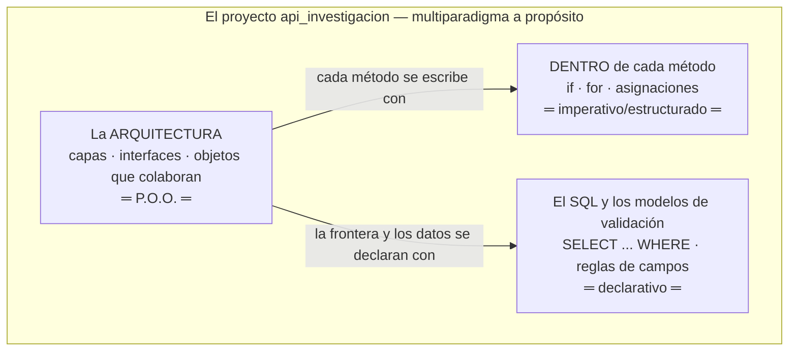
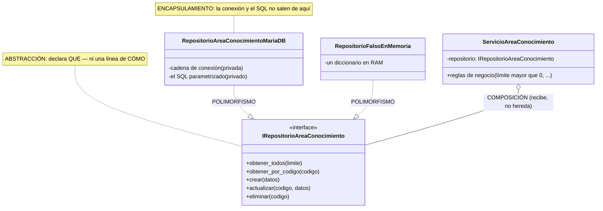
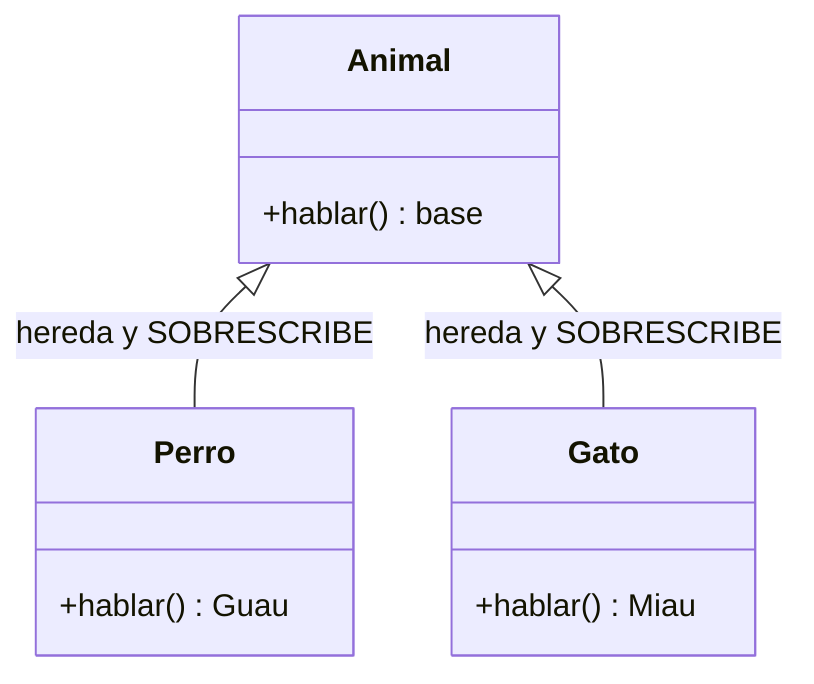
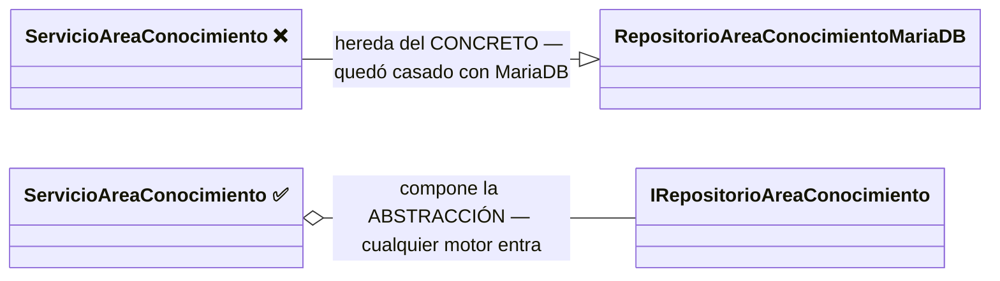
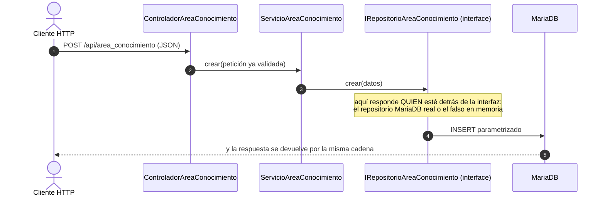

# El paradigma de Programación Orientada a Objetos (P.O.O.) en PHP

> Documento conceptual del curso. Qué es un paradigma, qué propone la P.O.O.,
> por qué este proyecto la usa, y dónde verla funcionando en la versión 1.

---

## 1. ¿Qué es un paradigma de programación?

Un paradigma es una **forma de pensar y organizar los programas**: qué es la
unidad básica de construcción y cómo se combinan. Los grandes paradigmas:

| Paradigma | Unidad básica | Idea central | Ejemplo |
|---|---|---|---|
| **Imperativo/estructurado** | la instrucción y el procedimiento | Secuencia, decisión, ciclo | C, Pascal |
| **Orientado a objetos** | el **objeto** (datos + comportamiento) | Objetos que colaboran enviándose mensajes | Java, C#, PHP moderno |
| **Funcional** | la función pura | Transformar datos sin estado mutable | Haskell, Elixir |
| **Declarativo** | la descripción del resultado | Decir QUÉ, no CÓMO | SQL, HTML |

PHP es **multiparadigma** — y este proyecto lo demuestra: se escribe código
estructurado (el router de `index.php`), orientado a objetos (las capas),
declarativo (el SQL) y ocasionalmente funcional (`array_map` con funciones
flecha). PHP nació como lenguaje de scripts y fue incorporando P.O.O. seria
(clases, interfaces, tipos) hasta el PHP 8 actual — saber cuándo usar cada
paradigma ES la competencia del curso.

### 1.1 El MISMO problema en tres paradigmas (ejemplo comparado)

Problema: saber cuántas fichas activas hay por gran_area. Mírelo tres veces:

```
// IMPERATIVO: el CÓMO, paso a paso (así se ve DENTRO de un método)
$conteo = [];
foreach ($filas as $f) {
    $clave = $f['gran_area'];
    $conteo[$clave] = ($conteo[$clave] ?? 0) + 1;
}
```

```sql
-- DECLARATIVO: el QUÉ, sin pasos — el motor decide el CÓMO
SELECT gran_area, COUNT(*) FROM area_conocimiento
WHERE activo = TRUE GROUP BY gran_area;
```

```
// P.O.O.: objetos que colaboran — cada uno con SU responsabilidad
$servicio->contarPorGranArea();   // el servicio le PIDE al repositorio;
                       // nadie de afuera ve SQL ni conexiones
```

> **Ese último método todavía no existe**, y se dice para que nadie lo
> busque: la v1 solo lista, obtiene, crea, reemplaza, actualiza y retira.
> Está escrito así para mostrar **dónde viviría** el día que se necesite —
> en el servicio, no en el controlador ni en la pantalla.

Los tres resuelven lo mismo. La diferencia es QUIÉN carga con el detalle:
en el imperativo usted; en el declarativo el motor; en la P.O.O. cada
objeto carga con SU parte — y eso es lo que permite cambiar una pieza sin
tocar las demás.

### 1.2 Dónde vive cada paradigma en ESTE proyecto (Mermaid)



**Guía de lectura:** los paradigmas no compiten — conviven por niveles. La
P.O.O. organiza el edificio; el imperativo pone los ladrillos dentro de
cada método; el declarativo describe datos y consultas. Saber CUÁL usar en
cada nivel es la competencia, no militar en uno.

## 2. Los cuatro pilares de la P.O.O.

### 2.1 Abstracción
Quedarse con lo esencial y esconder el detalle. `IRepositorioAreaConocimiento` es una
abstracción: define QUÉ se puede hacer con áreas de conocimiento (obtener, crear,
actualizar, eliminar) sin decir CÓMO ni DÓNDE se guardan.

### 2.2 Encapsulamiento
Cada objeto guarda su estado y expone solo operaciones. En la v1,
`RepositorioAreaConocimientoMariaDB` encapsula la conexión PDO y el SQL: sus
propiedades son `private readonly` y nadie más en el sistema sabe que existe
un DSN. PHP lo refuerza con modificadores explícitos (`private`, `protected`,
`public`) — más estrictos que otros lenguajes del curso.

### 2.3 Herencia (y por qué aquí casi no se usa)
Reutilizar definiendo una clase a partir de otra (`extends`, "es-un"). Es el
pilar más famoso y el más **sobreutilizado**: la herencia acopla fuerte. La
regla moderna es **composición sobre herencia** — y este proyecto la sigue:
`ServicioAreaConocimiento` no HEREDA de un repositorio, RECIBE un repositorio por
constructor (composición + inyección). El único `extends` de la v1 es
`NoEncontradoExcepcion extends Exception` — herencia bien usada: una
excepción ES una excepción.

### 2.4 Polimorfismo
Distintas clases responden al mismo mensaje, cada una a su manera. Es el
pilar que sostiene todo el proyecto: cualquier clase con
`implements IRepositorioAreaConocimiento` puede ocupar el lugar de otra — el MariaDB
real, el falso en memoria de `pruebas/prueba_capas.php`, o el PostgreSQL que
llegará en la v3.

### 2.5 Los cuatro pilares, dibujados sobre la v1 (Mermaid)



**Guía de lectura:** los cuatro pilares están en UN dibujo. La interfaz es
la abstracción; los atributos privados del repositorio son el
encapsulamiento; las dos flechas punteadas que llegan a la misma interfaz
son el polimorfismo (piezas intercambiables); y el rombo del servicio es
composición: recibe el repositorio por constructor en vez de heredarlo.

**Las DOS caras del polimorfismo (aclaración importante).** La
definición es una sola: **el MISMO mensaje, respuestas DIFERENTES**. Pero
se logra de dos maneras, y conviene distinguirlas:

**Cara A — la del libro: herencia + sobrescritura.** Un método existe en
la clase PADRE y la clase hija lo vuelve a programar a su manera
(sobrescribir / override):

```php
class Animal
{
    public function hablar(): string { return "..."; }   // vive en el PADRE...
}
class Perro extends Animal
{
    public function hablar(): string { return "¡Guau!"; } // ...la hija SOBRESCRIBE
}
class Gato extends Animal
{
    public function hablar(): string { return "¡Miau!"; }
}
// foreach ($animales as $a) { $a->hablar(); }  ← el MISMO mensaje, DOS respuestas
```



**Cara B — la de ESTE proyecto: contrato + implementaciones.** Aquí NO hay
clase padre con código: hay una **interfaz**, que declara el mensaje pero
no trae ninguna programación. Dos clases sin parentesco entre sí lo
responden, cada una a su modo:

```php
// El contrato NO tiene código: solo declara el mensaje
interface IRepositorioAreaConocimiento
{
    public function crear(array $datos): bool;
}

// Dos clases SIN parentesco responden el MISMO mensaje, cada una a su modo:
class RepositorioAreaConocimientoMariaDB implements IRepositorioAreaConocimiento
{
    public function crear(array $datos): bool
        { /* ejecuta un INSERT parametrizado (PDO) en MariaDB */ }
}
class RepositorioFalsoEnMemoria implements IRepositorioAreaConocimiento
{
    public function crear(array $datos): bool
        { $this->filas[$datos['codigo']] = $datos; return true; } // RAM
}
```

Cuando `ServicioAreaConocimiento` manda el mensaje `crear(datos)`, NO sabe (ni le
importa) cuál de las dos clases contesta — una escribe en MariaDB, la otra en
un diccionario. **Eso es el polimorfismo del diagrama de arriba:** las dos
flechas punteadas que llegan a la interfaz son las dos respuestas
posibles al mismo mensaje.

| | Cara A (herencia) | Cara B (contrato — la del proyecto) |
|---|---|---|
| ¿Dónde se declara el mensaje? | En la clase PADRE (con código propio) | En la INTERFAZ (sin una línea de código) |
| ¿Las clases se emparentan? | Sí: hija ES-UN padre | No: solo firman el mismo contrato |
| ¿Qué se comparte? | Código heredado + el mensaje | SOLO el mensaje |
| Riesgo | Acopla: la hija arrastra TODO lo del padre | Ninguno de acoplamiento: por eso el curso la prefiere |

Las dos son polimorfismo legítimo. El proyecto usa la cara B porque
necesita piezas intercambiables SIN compartir código (un repositorio real
y uno falso no tienen nada en común por dentro) — y porque es la que
permite cambiar de motor sin tocar el servicio.

**¿Y la herencia DE VERDAD, dónde está en este proyecto?** En las
excepciones: `class NoEncontradoExcepcion extends Exception` — hereda todo
lo que una excepción sabe hacer y solo aporta su NOMBRE, que es lo que
permite el catch selectivo (404 vs 500). Herencia bien usada: pequeña y
con motivo.

**Herencia vs composición — el error clásico, dibujado:**



**Guía de lectura:** si el servicio HEREDA del repositorio concreto, cambiar
de motor exige tocar el servicio (y probar sin BD es imposible). Si lo
COMPONE a través de la interfaz, el motor se cambia por fuera — esa
decisión de un solo rombo es la que paga todo el proyecto.

**"Objetos que se mandan mensajes" — la v1 como conversación.**
¿Quién es **Alan Kay**? El científico que ACUÑÓ el término "orientado a
objetos": creó Smalltalk en Xerox PARC (años 70) y recibió el premio
Turing (2003). Y dijo algo sorprendente: se arrepentía de haberlo llamado
"objetos", porque *"la gran idea es el ENVÍO DE MENSAJES"* — cada objeto
es una cajita cerrada que recibe un mensaje, lo resuelve por dentro como
quiera y responde, sin que el remitente sepa CÓMO. En la práctica, cada
llamada a un método ES un mensaje. Mire la v1 con esos ojos:



**Guía de lectura:** cada flecha es un MENSAJE entre objetos — ninguno sabe
CÓMO trabaja el siguiente, solo QUÉ mensaje entiende. Esa era la idea
original de Alan Kay al acuñar "orientado a objetos": menos árboles de
herencia, más objetos conversando.

## 3. La P.O.O. en PHP: lo que este proyecto explota

- **`interface` nativa** — el contrato es una construcción del lenguaje:

```php
interface IRepositorioAreaConocimiento
{
    public function obtenerTodos(int $limite): array;
    public function obtenerPorCodigo(string $codigo): ?array;
    public function crear(array $datos): bool;
    public function actualizar(string $codigo, array $datos): int;
    public function eliminar(string $codigo): int;
}

class RepositorioAreaConocimientoMariaDB implements IRepositorioAreaConocimiento { … }
```

  A diferencia del *duck typing* de lenguajes dinámicos, aquí el compromiso
  es **explícito**: si a la clase le falta un método del contrato, PHP no la
  deja existir (error fatal). Tipado **nominal**: se ES del tipo porque se
  DECLARA.
- **Tipos estrictos** (`declare(strict_types=1)`): `int $limite` rechaza
  `"7"` — el tipo también es regla de negocio.
- **Constructor promotion + `readonly`** (PHP 8): el constructor declara,
  asigna y protege las dependencias en una sola línea:
  `private readonly IRepositorioAreaConocimiento $repositorio`.
- **El modelo es el dato como objeto**: la clase `AreaConocimiento` con sus 4
  propiedades tipadas — un `gran_area` que SIEMPRE es entero.
- **La frontera de entrada se construye a mano**: la validación del body
  vive en el controlador (la puerta HTTP) y hace lo que en otros stacks hace
  una librería — construirla enseña qué ES validar (tipos, rangos,
  obligatoriedad, lista blanca de columnas).

## 4. Justificación: por qué P.O.O. para este proyecto

1. **El dominio se modela solo:** area_conocimiento, registro, cliente… son objetos
   naturales con datos y reglas propias.
2. **El polimorfismo es EL requisito:** la meta del proyecto (cambiar de motor
   de BD sin tocar código) es literalmente un ejercicio de polimorfismo —
   repositorios intercambiables tras una interfaz.
3. **Probabilidad de prueba:** el criterio de aceptación 6 de la v1 (probar el
   servicio con un repositorio falso en memoria) solo es posible porque el
   servicio depende de una abstracción, no de MariaDB.
4. **Puente a SOLID:** los principios SOLID (documento
   [SOLID_CAPAS_PATRONES.md](SOLID_CAPAS_PATRONES.md)) son reglas de diseño **dentro** del
   paradigma orientado a objetos — sin P.O.O. no hay SOLID que aplicar.

## 5. Ejemplo resumido: la v1 vista con lentes de P.O.O.

```
AreaConocimiento (el modelo)         ← la clase entidad: el dato con tipos
ControladorAreaConocimiento          ← objeto HTTP; valida el body y compone un IServicioAreaConocimiento
ServicioAreaConocimiento             ← objeto de NEGOCIO; compone un IRepositorioAreaConocimiento
IRepositorioAreaConocimiento         ← contrato (interface): abstracción pura
RepositorioAreaConocimientoMariaDB   ← implementación concreta (encapsula PDO y SQL)
RepositorioFalsoEnMemoria    ← otra implementación (¡polimorfismo!) para probar sin BD
```

El mismo `ServicioAreaConocimiento` funciona con ambos repositorios sin cambiar una
línea — eso es el paradigma haciendo su trabajo. En la v3, un tercer objeto
(`RepositorioAreaConocimientoPostgreSQL`) entrará por la misma puerta.

## 6. Referencias

1. PHP — manual oficial de clases y objetos:
   <https://www.php.net/manual/es/language.oop5.php>
2. PHP — interfaces de objetos:
   <https://www.php.net/manual/es/language.oop5.interfaces.php>
3. PHP — declaraciones de tipos estrictos:
   <https://www.php.net/manual/es/language.types.declarations.php>
4. Refactoring Guru (es) — catálogo de patrones de diseño orientados a objetos:
   <https://refactoring.guru/es/design-patterns>
5. Gamma, Helm, Johnson, Vlissides — *Design Patterns* (GoF, 1994): el origen
   de "composición sobre herencia" y "programar contra interfaces".
6. En este repositorio: las interfaces y capas de la
   [v1](spec_kit/versiones/v1_area_conocimiento/3_plan.md).
