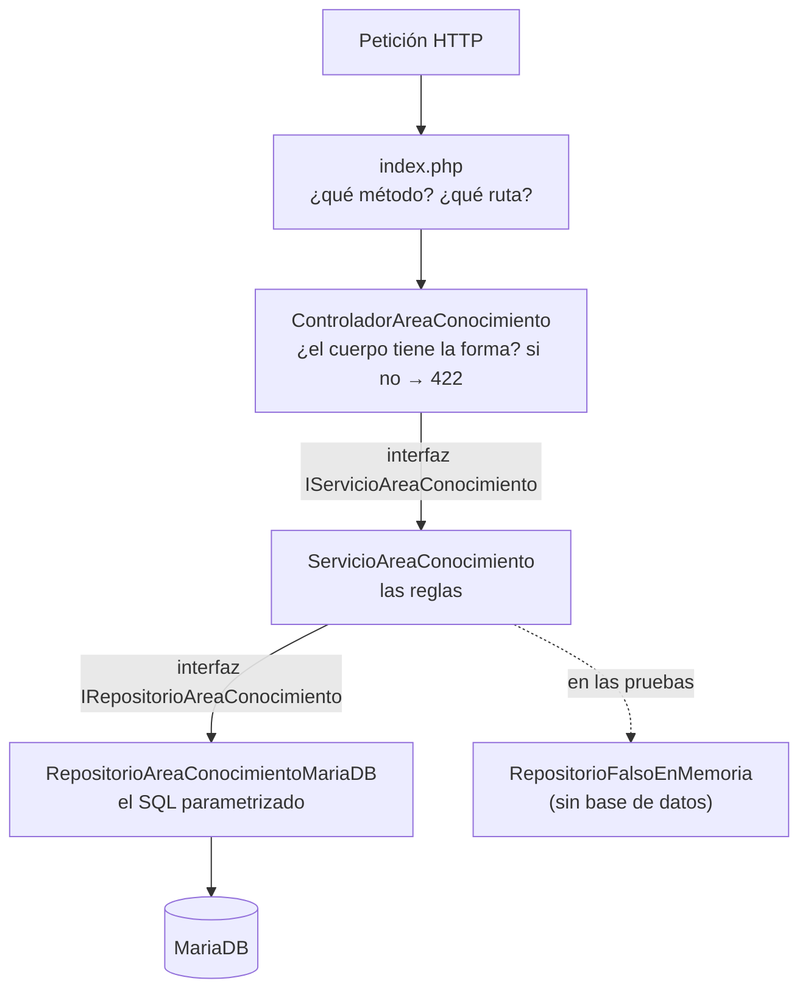

# Plan técnico — v1: `area_conocimiento` (PHP + MariaDB)

## 1. El árbol, y qué hace cada carpeta

```
api_investigacion/
├── index.php               ENRUTA: método + ruta → método del controlador
├── controladores/
│   └── ControladorAreaConocimiento.php
│                           HTTP: valida la FORMA del cuerpo (422) y traduce
│                           las excepciones a códigos. Sin SQL, sin reglas.
├── servicios/
│   ├── IServicioAreaConocimiento.php
│   ├── ServicioAreaConocimiento.php
│   │                       Las REGLAS. Lanza excepciones de negocio; aquí no
│   │                       aparece la palabra HTTP ni una vez.
│   └── ensamblador.php     El ÚNICO archivo que hace `new` de clases concretas
├── repositorios/
│   ├── IRepositorioAreaConocimiento.php
│   └── RepositorioAreaConocimientoMariaDB.php
│                           El SQL, en prepared statements. Único que conoce PDO.
├── modelos/AreaConocimiento.php     La fila como objeto: privadas + getters + setters
├── excepciones/            Las de negocio, sin HTTP adentro
└── pruebas/prueba_capas.php
```

## 2. El recorrido de una petición



Las dos flechas punteadas son el punto: el servicio depende de **la
interfaz**, así que en `prueba_capas.php` se le enchufa un repositorio que
guarda en un array, y **la prueba pasa con MariaDB apagada**.

## 3. Las decisiones de diseño

### 3.1 La validación se escribe, no se declara

En el gemelo (FastAPI) la forma del cuerpo se declara en un modelo de
Pydantic y el framework responde 422 solo. Aquí cada regla es un `if`:

```php
if (array_key_exists('gran_area', $datos)) {
    $v = $datos['gran_area'];
    if (!is_string($v) || trim($v) === '' || mb_strlen($v) > 60) {
        $errores[] = 'El campo gran_area debe ser un texto de 1 a 60 caracteres.';
    }
} elseif ($obligatorios) {
    $errores[] = 'El campo gran_area es obligatorio.';
}
```

Es más largo, y hay que acordarse de mantenerlo cuando el modelo cambie. A
cambio: **el mensaje está en español, nombra el campo, y sale por el sobre
que documenta el contrato**. El gemelo no puede decir lo mismo — FastAPI
envuelve todo en `detail` y redacta en inglés.

Ninguna de las dos gana siempre. Lo que importa es que la decisión esté
tomada a la vista.

### 3.2 PUT y PATCH: la diferencia no la decide un `if`

El mismo método privado, con un booleano:

```php
$this->validarCampos($cuerpo, true);    // PUT:   todos obligatorios
$this->validarCampos($cuerpo, false);   // PATCH: solo lo que llegue
```

Y el repositorio arma el `SET` **con las columnas que llegaron**, así que el
PATCH escribe solo eso. Lo que no se envía, no se toca — y la prueba de humo
lo comprueba contra los datos, no contra la pantalla.

### 3.3 Dos interfaces, y para qué sirven de verdad

`IServicioAreaConocimiento` e `IRepositorioAreaConocimiento` son interfaces nativas de PHP. **No las
obliga el lenguaje**: PHP corre igual sin ellas.

Sirven para algo comprobable: cambiar el repositorio real por uno falso sin
tocar el servicio. Si el servicio conociera la clase concreta, la prueba de
capas sería imposible.

### 3.4 El servicio no sabe qué es un 404

Lanza `NoEncontradoExcepcion`. El controlador la atrapa y responde 404. Si
mañana esta lógica se usara desde una tarea programada, sin HTTP de por
medio, el servicio funcionaría igual.

### 3.5 Dos trampas de MariaDB que están resueltas en el código

| Qué pasa | Dónde está resuelto |
|---|---|
| `rowCount()` de un `UPDATE` cuenta filas **cambiadas**: reenviar los mismos datos da 0, y parecería que la llave no existe → 404 falso | `PDO::MYSQL_ATTR_FOUND_ROWS => true` en el repositorio |
| Un `LIMIT` con el valor enlazado como texto es **error de sintaxis** | `bindValue(':limite', $limite, PDO::PARAM_INT)` |

### 3.6 El borrado lógico se escribe en CADA consulta

Las cuatro consultas del repositorio llevan `activo = TRUE`. Es la regla que
más fácil se olvida al agregar una consulta nueva, y por eso no se factorizó
a un sitio «inteligente»: está a la vista en cada una.

El `AND activo = TRUE` del `DELETE` tampoco sobra: sin él, retirar dos veces
la misma fila respondería 200 las dos veces, y el segundo tiene que dar 404.

## 4. El front

```
front_php/
├── index.php          ENRUTA las pantallas. Y devuelve `false` para los
│                      archivos estáticos (ver abajo).
├── cliente_api.php    Lo ÚNICO que habla HTTP. Trabaja con ARRAYS, no con
│                      las clases de la API.
├── vistas/            plantilla (el marco) + inicio, lista, formulario, 404
└── publico/           Bootstrap descargado + los estilos del proyecto
```

### La trampa del router de `php -S`

Con `php -S 0.0.0.0:8110 index.php`, PHP ejecuta el router
para **todas** las peticiones, también para `/publico/estilos.css`. Sin
tratarla, la hoja de estilos cae en el 404 del router y el navegador recibe
HTML donde espera CSS: **la pantalla sale sin un solo estilo, con un 200 en
el registro**.

```php
if (PHP_SAPI === 'cli-server') {
    $archivo = __DIR__ . $ruta;
    if ($ruta !== '/' && is_file($archivo)) {
        return false;      // «yo no me encargo de ésta»
    }
}
```

Por eso el criterio P3 comprueba el **tipo de contenido**, no el código de
estado. Un 200 no dice que la página se vea.
