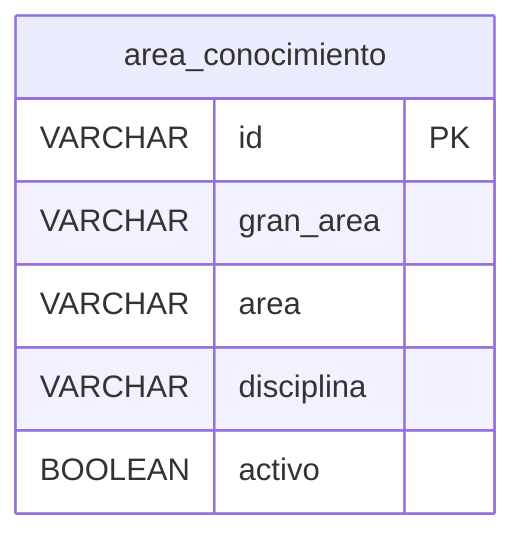

# Modelo de datos — v1: `area_conocimiento` (MariaDB)

## 1. La tabla

| Columna | Tipo | |
|---|---|---|
| `id` | `VARCHAR(6)` | **Llave primaria** |
| `gran_area` | `VARCHAR(60)` | No nulo |
| `area` | `VARCHAR(60)` | No nulo |
| `disciplina` | `VARCHAR(150)` | No nulo |
| `activo` | `BOOLEAN` (alias de `TINYINT(1)`) | No nulo, por defecto `TRUE` — **agregada**, ver §3 |

## 2. Lo que el esquema dado tiene y no se corrige

El esquema es **artefacto dado** (Artículo 5). Estas cosas quedan anotadas,
no arregladas, porque la v1 no las necesita y arreglarlas sería tocar lo que
nadie pidió:

- las tablas del módulo traen erratas de digitación en algunos nombres de
  columna (`universidsad`, `nacionalidaad`, `experiecia`). Se dejan **tal
  cual**: cambiarlas obligaría a cambiar también el script del curso, y
  entonces los dos dejarían de coincidir;
- varias fechas están declaradas como texto en vez de `DATE`. La v1 no hace
  aritmética de fechas, así que no le estorba. La versión que las compare
  tendrá que decidir.

## 3. Los cambios que SÍ se aplicaron, y por qué

Están numerados en la cabecera de `db/init.sql`, uno por uno. En resumen:

| | Cambio | Motivo |
|---|---|---|
| C1 | `area_conocimiento.id`: `INT` → `VARCHAR(6)` | Los datos son códigos como `1A01`. Como estaba, el script no podía cargar su propio catálogo |
| C2 | `area_conocimiento.disciplina` → `VARCHAR(150)` | El valor más largo tiene 124 caracteres |
| C3 | Un ancho más, propio de este módulo | Ver la cabecera del script |
| C4 | Las 16 tablas del módulo ganan `activo` | El borrado es lógico (Artículo 6) |
| C5 | `'Cienias Naturales'` → `'Ciencias Naturales'` (48 filas) | Errata de la fuente; cargarla la deja a la vista en cada listado |

## 4. `activo` no es un campo de la ficha

No está en el modelo `AreaConocimiento`, no viaja en el JSON, y **no está en la
lista blanca** del controlador. Se escribe en un solo sitio: el `UPDATE` del
método `eliminar()` del repositorio.

Si estuviera en el modelo, tarde o temprano alguien lo mandaría en un PUT — y
entonces retirar una ficha dejaría de ser una operación con nombre propio
para volverse un campo más que cualquiera puede tocar.

## 5. Las semillas

La tabla arranca con **218 filas**. De dónde salió cada
columna está escrito **dentro de `db/init.sql`, encima del `INSERT`** — no
solo aquí, porque ahí lo lee quien mire los datos.

Los catálogos del módulo que además vienen cargados son infraestructura: la
v1 no los nombra, pero están, porque la base se crea completa.

## 6. Quién escribe qué

| Dato | Dueño | La API… |
|---|---|---|
| `id` | Quien crea el registro | Lo escribe **solo** en el `POST`. Un `PUT` o un `PATCH` nunca lo cambian: identifica la fila |
| Los demás campos | La API | Los escribe en `POST`, `PUT` y `PATCH` |
| `activo` | La API, pero **solo** por `DELETE` | **Tiene prohibido** recibirlo en el cuerpo |
| Las otras 18 tablas | Nadie, en la v1 | No las nombra |
